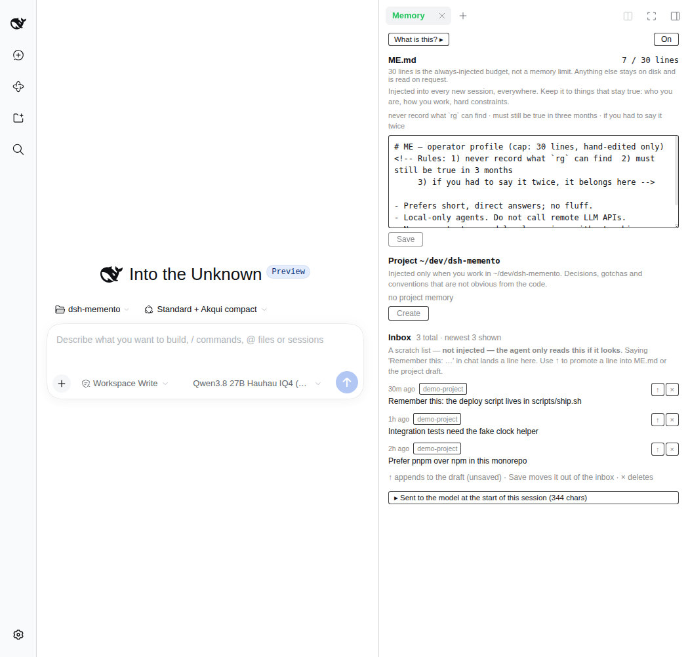
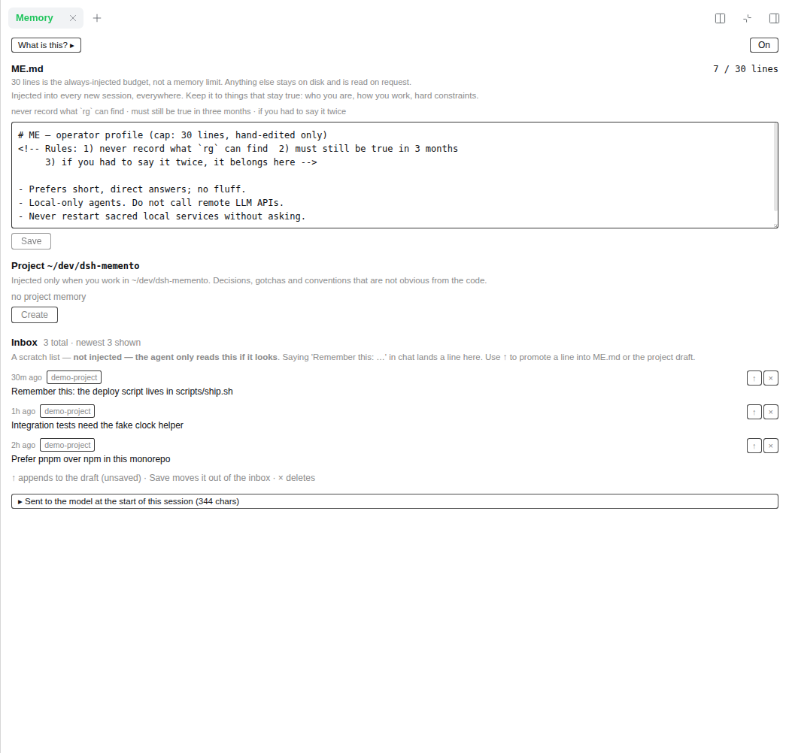
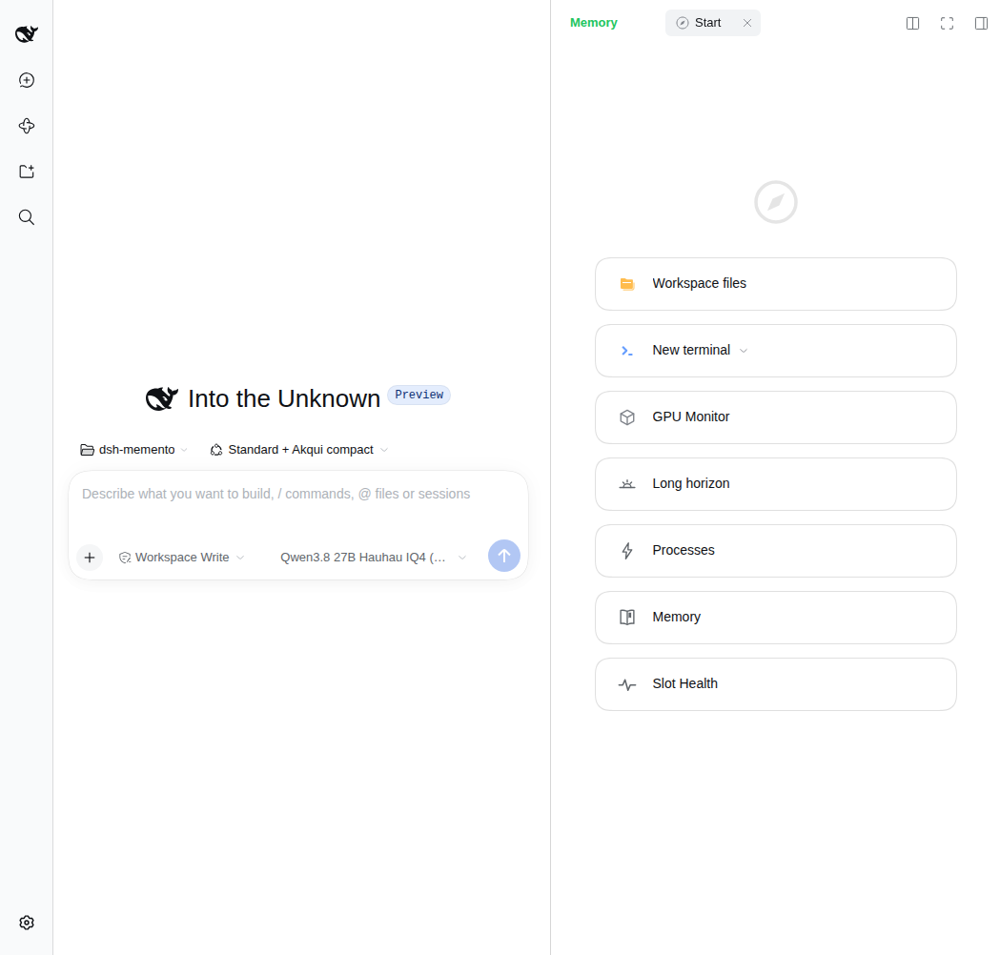

# dsh-local-memento

Bounded-file **memory** for local coding agents in the **DeepSeek Harness**
web UI.

> npm package name is **`dsh-local-memento`** (`dsh-memento` was already taken
> on the registry). The GitHub repo remains
> [`janpauldahlke/dsh-memento`](https://github.com/janpauldahlke/dsh-memento).

New sessions get a warm start from a short `ME.md` profile and an optional
project `MEMORY.md`. Capture is free (`Remember this:` → inbox). Promotion into
the injected tier is a human edit in the **Memory** rightbar — never an
automatic write. No embeddings, no vector store, no LLM calls inside the plugin.

**Related plugins** (same dual-face `dsh.bundle` shape for the web rightbar):

| Plugin | Repo |
| --- | --- |
| Process & port lifecycle | [`dsh-agent-processes`](https://github.com/janpauldahlke/dsh-agent-processes) |
| Long-horizon task status | [`dsh-local-long-horizon`](https://github.com/janpauldahlke/dsh-local-long-horizon) |
| NVIDIA GPU util / VRAM / power | [`dsh-gpu-monitor-nvml`](https://github.com/janpauldahlke/dsh-gpu-monitor-nvml) |
| Local LLM endpoint / slot health | [`dsh-slot-health`](https://github.com/janpauldahlke/dsh-slot-health) |

This package: [`dsh-local-memento`](https://www.npmjs.com/package/dsh-local-memento)
· source [`janpauldahlke/dsh-memento`](https://github.com/janpauldahlke/dsh-memento).

Verified against DeepSeek Harness **`0.1.7-rc.2`** (`dsh web`).

---

## Requirements

- DeepSeek Harness web profile (`dsh web`).
- Node.js **≥ 20** to build.

---

## Screenshots

Light theme, matching the DSH default.

| Pane + chat | Memory pane (fullscreen) |
| --- | --- |
|  |  |

| Start guide (Memory book icon) |
| --- |
|  |

---

## What you see

- **Memory rightbar** — edit `ME.md` and the project file, promote or delete
  inbox lines, preview what was injected, toggle the plugin on/off.
- **Status tint on the tab title** — green when On, grey when Off, yellow on
  poll/write error.
- **Inbox** — scratch list from `Remember this:` / `memory_remember`. Not
  injected; the agent only reads it if it looks under `~/.dsh/memory/`.
- **↑ promote** — appends a line into the ME or project **draft** (unsaved).
  Save moves it out of the inbox (with Undo).

---

## Install

### From npm (recommended)

```sh
dsh plugin --profile web add dsh-local-memento
# restart dsh web (or rely on live patch reload), then hard-refresh the browser
```

### From GitHub

```sh
dsh plugin --profile web add github:janpauldahlke/dsh-memento
```

### From a git checkout (developers)

```sh
git clone https://github.com/janpauldahlke/dsh-memento.git
cd dsh-memento
npm install && npm run build
dsh plugin --profile web add "$(pwd)"
```

Restart (or boot) `dsh web` so the host + client faces load:

```sh
env -u DSH_WEB_URL -u DSH_SHELL -u DSH_SESSION_ID dsh web --no-open
```

Uninstall:

```sh
dsh plugin --profile web remove dsh-local-memento
# restart the web instance that had the plugin
```

---

## First run — write your own `ME.md`

On first boot the plugin creates `~/.dsh/memory/ME.md` from a **generic
template** (rules + commented example lines only). It does **not** ship anyone
else’s profile.

1. Open the **Memory** rightbar.
2. Replace the commented examples with facts that stay true for you.
3. Save. New sessions inject that file verbatim.

Existing `ME.md` is never overwritten by install or upgrade — only created when
absent.

Project lore lives in
`~/.dsh/memory/projects/<key>/MEMORY.md` (Create from the pane when you want
it). The inbox is `~/.dsh/memory/inbox.md`.

---

## Agent tools

| Tool | Purpose |
| --- | --- |
| `memory_remember` | Append one line to the inbox (escape hatch; never touches ME / project) |
| `memory_history_search` | Read-only archaeology over ended session logs (fail-open) |

Triggers in chat (also inbox-only): `Remember this:`, `Remember:`, `Note this:`.

---

## Surfaces

| Surface | Path / name |
| --- | --- |
| Vault | `~/.dsh/memory/` (`ME.md`, `inbox.md`, `projects/…/MEMORY.md`) |
| Master switch | `~/.dsh/memory/.off` (pane On/Off) |
| HTTP | `GET /api/dsh-memento/health`, `/state`, `/compliance`, … |
| UI | Rightbar **Memory** |

---

## Design in five lines

1. **`ME.md`** (~30 lines) and optional project **`MEMORY.md`** (~45 lines) are
   the only always-injected tier.
2. **The cap is pressure, not a block** — over-cap saves are accepted; you curate.
3. **`inbox.md`** is append-only and never injected.
4. **The agent never writes the injected tier** — promotion is a human pane edit.
5. **Ritual over judgment** — read project memory before the first file edit;
   compliance observes, never blocks.

Deliberately absent: embeddings, Qdrant, FTS, promote ladders, frontmatter
schemas, and LLM calls inside the plugin.

---

## Architecture

Dual-face package (same bar as the other web rightbar plugins):

- **Host** (`lib/index.js`, ESM) — vault, inject, inbox, compliance, HTTP, tools.
- **Client** (`lib/client.js`, CJS ModuleLoader factory) — Memory rightbar.
- **Glue** — `cordis.patch.yml` + `dsh.bundle` / `dsh.client` in `package.json`.

Templates under `assets/` are **inlined at build time**; they are not read from
disk at runtime.

---

## License

MIT — see [`LICENSE`](./LICENSE).
